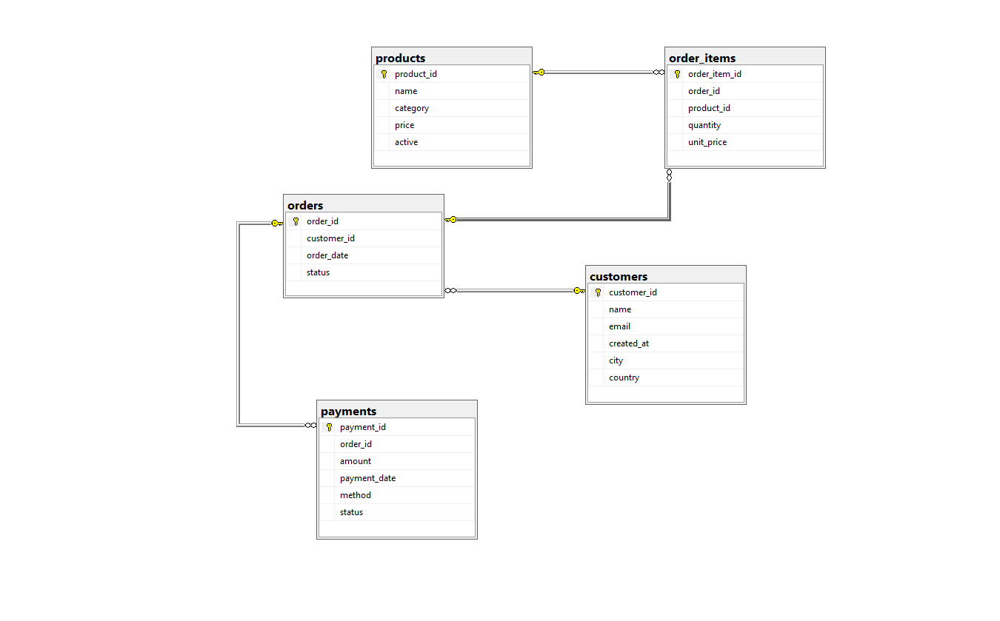

# Ecommerce SQL Project

This project builds a small **E-commerce database** using **SQL Server** and performs analytical queries on the data.

---

## Project Structure

```
Ecommerce_SQL_Project
│
├── Ecommerce_SQL_Project.sql
├── ERD.png
└── README.md
```

---

## Database Tables

The database consists of the following tables:

* **customers** → stores customer information
* **products** → stores product details
* **orders** → records customer orders
* **order_items** → stores products inside each order
* **payments** → stores payment information for orders

---

## ERD (Database Diagram)



---

## Analytics Queries

The project includes the following analytical queries:

1. **Top 3 customers by spending**
   Finds the customers who spent the most money.

2. **Orders above average**
   Shows payments that are higher than the average payment.

3. **Customers with orders in the last 6 months**
   Identifies customers who placed orders recently.

4. **Customer segmentation using CASE**
   Classifies customers based on the number of orders:

   * New
   * Regular
   * VIP

---

## Example Query

```sql
SELECT TOP 3 
c.name,
SUM(p.amount) AS total_spent
FROM customers c
JOIN orders o
ON c.customer_id = o.customer_id
JOIN payments p
ON o.order_id = p.order_id
WHERE p.status = 'succeeded'
GROUP BY c.name
ORDER BY total_spent DESC;
```

---

## Technologies Used

* SQL Server
* SQL (DDL & DML)
* GitHub for version control

---

## Author

**Tharwat Farag**
Data Engineering Track
